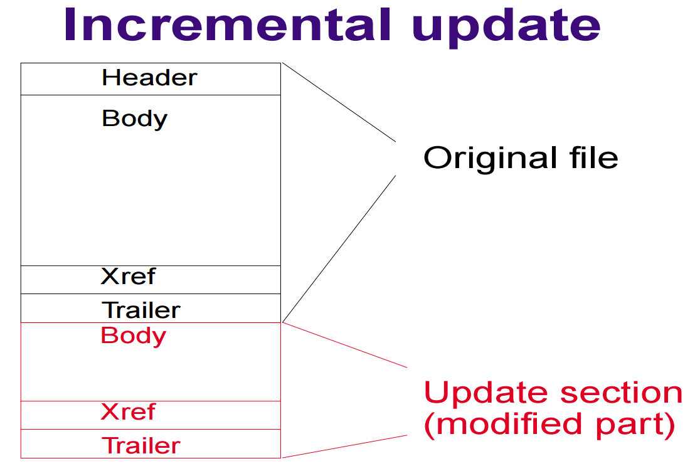

**[Home](https://planepaper.github.io/ko/) >> Incremental Update**

# 増分アップデート

ファイルの更新が必要な状況で、変更されたものだけが含まれたパッチファイルをダウンロードし、ローカルで直接パッチする方法

## 概要

2021年、ITワクチン会社で産業技能要員(兵役制度)として働いていた当時「増分アップデート」というプロジェクトを一人で担当した。

会社ではAWS3から1MBファイルを顧客に毎回提供していたが、

このファイルは顧客にとって非常に重要なファイルで、内容が変更されるやいなや顧客は再びダウンロードしなければならなかった。

- 一日に7回ほど内容が頻繁に変更されていたが、変更内容は極めて少ないし

- 「既存クライアントは当該1MBファイル全体を再度受け取る必要があった。`

- **そのため、該当トラフィックにかかる費用が非常に高かった。**

当時新入社員として多少萎縮していた私にものすごい成長と自信感を植え付けてくれたプロジェクトでもある。

## 実装方式

この1MBファイルの内容変更は他の部署で行われた。

したがって、既存の仕事処理方式を最大限維持する方向で機能を検討した。

1. 他の部署で1MBファイルを変更してアップロードする時、自動化triggerが作動し直前アップロードファイルと現ファイルのdiffでパッチファイルを作るようにした。

2. そして、このパッチファイルをサーバーに自動的に配布し、クライアントがアップデート時に該当ファイルを利用するようにした。

3. クライアントでは、ダウンロードした該当パッチファイルを現在の1MBファイルに適用できるようにした。

## 使用技術スタック

- c++ 静的ライブラリ
  - ワクチンプログラムがc++であったため、静的ライブラリにして挿入した。

- bsdiff オープンソースライブラリ
  - cライブラリであるため、c++に呼び出せるようにした。
  - パッチファイル生成にはbsdiff、パッチファイル適用にはbspatchを使用した。

  - gtest
    - 静的ライブラリテストのために使用した。 ci/cd 自動化テストでも利用

  - nginx
    - テスト部分のサーバー状況を実現するために導入

 - python
    - ci/cdスクリプトでawsに自動パッチファイル生成およびアップロード機能を作った。

## 結果

結果的に既存トラフィックの合計60%のコストを削減することができた。

## ロールバック事故

最初に完成して配布した結果、既存トラフィックがむしろ3倍増え、一日で急いでロールバックされた。

- 既存のアップデートロジックがある特殊な状況で、直ちに3回以上アップデートを試みたのが問題だった。
  - そのため、増分アップデートコードが3回以上動作し、異常なトラフィックが発生したのだ。

- 短期間の開発だったため、End-to-endテストを自動化ではなく手動で行って逃した問題だった。
  - そして、既存のアップデートロジックをもう少し細かくチェックし、end-to-endテストを自動化で構成した。

- 今後、安定性を点検した後、再び配布した結果、上記のようにトラフィックをよく減らすことができた。

## 難しかった点

1. 既存のアップデートロジックに新しく移植することが非常に難しかった。

- 担当していたソフトウェアはVS2003環境に約20年ほど経ったソフトウェアであり、アップデートロジック部分がこれまでリファクタリングされなかった。
- したがって新入社員である私が該当コードを全て分析し、新しい機能を挿入、そしてテスト環境を構成することが非常に大変だった。

2. VS2003に新機能を開発するのが難しかった。

- とても古いideなので、サポートする機能がほとんど何もなかった。
- そこでまず、開発しようとする機能だけをVS2019環境で静的ライブラリにした。
- テストとともに安定した機能を確認した後でVS2003像の組み込み式で作業を進めた。

3. テストの実装が難しかった。

- やはり昔ideで開発されたプログラムだったので、テストコードの挿入が難しかった。
  - これもVS2019でgtestライブラリとnginxで自動化テストを行った。
- この機能は、必ずサーバの状況とともにテストされなければならなかった。
  - サーバー環境の具現が難しかった。 すべての場合におけるパッチファイルを手動で生成することも難しかった。
  - 自動化テストのために既存のci/cdにスクリプトを作成して入れることが難しかった。

## 総評

- クリーンコードでなくてもロジックの把握をもっとうまくできるように努力しなければならない。
- より安定した機能を確認するためのテスト実装に努めるべきである。
- ロールバック事故を防ぐため、できるだけ熱心に検討しなければならない。
