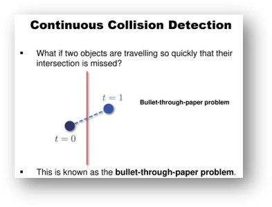
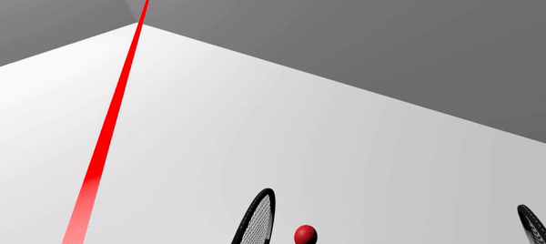
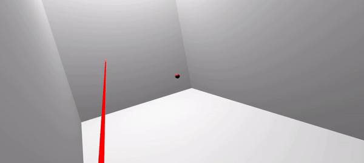

**[Home](https://planepaper.github.io/ja/) >> Racket Smash**

# RacketSmash

ユニティVRプロジェクト

[https://github.com/planepaper/RacketSmash](https://github.com/planepaper/RacketSmash)

- 学校のVRプロジェクトて「ラケットスマッシュ」というゲーム開発

- VRの中でボールをラケットで当てる3Dアーケードゲーム
- モードは計4種類を作り、「モグラ取り」、「クレイジー」、「モンスター取り」、そして「レンガ割り」である。
  - モグラ取り:正面から飛び出すモグラをボールで合わせるモード
  - クレイジー:いろんなところから飛び出すボールを打つモード
  - モンスターを捕まえる:上から落ちるモンスターを当てるモード
  - レンガ割り:正面のレンガ造形物をボールで合わせるモード
- チーム5人でunityを活用して当該ゲームを開発した。

### モグラ取りモード

### クレイジーモード

### サバイバルモード

### レンガ割りモード

## 任された役

全般的な「ボール飛ばし機能」と「レンガ割りモード」を担当した。

- ボール飛ばし機能は、まずラケットオブジェクトをトラッカーにMovePositionで追いかけるようにして実装した。 そしてボールとラケットをprefabにして他のモードで該当機能を同一に使えるようにした。
- レンガ割りモードは、ボールが部屋の中を自由自在に歩き回れるようにボールのマテリアルを無重力弾性衝突にした。 しかし、このようなボールの特性上、ユーザーがうまく打てるように戻ってこない問題が発生し、最終的にはボールがレンガから戻ってくる時、ユーザーの方に向かってくるよう修正して解決した。

## 難しかった点

### ネットワーク実装

既存の企画案はVRを持ったユーザーがマルチでスカッシュを楽しむことだった。
しかし、短期間でネットワーク部分を実現するのに苦労した。
Photon Network ライブラリを利用して実装したが、マスタークライアント以外のクライアントではボールが打てない問題が発生した。

他のクライアントが送ってくれるラケットのトラッキング情報がまともに伝達されなかったためだ。 そのため、マスタークライアント段で実際のボールのrigidbodyとラケットのrigidbody衝突計算に誤りが生じ、正常なボール動きがなされなかった。 また、ラケットとボールの動きにもディレーが発生し、ネットワーク環境でも一人でボールをやり取りすることができなかった。

#### シンクが合わない

#### ボールを打てない

#### ディレー発生

## したがって、現企画に

このような理由で与えられた時間でマルチ環境を構成することは難しいと判断し、既存の企画の代わりにもう少し軽いコンセプトの企画を新しく構想する必要があると考えた。 シングルアーケードゲームに転向し、よりストーリーラインとコンセプトを強化させてカジュアルな面白さを生かす方向を構想した。

## 結果

上記機能とモードの実装を通じてVRプロジェクトを成功裏に完了し、簡単なゲーム方式と涼しい打撃感でデモ試演会で大きな人気を得た。 また、教授もボールの作動方式がモードごとに異なることに対して多様なユーザー経験を提供したと高く評価してくださった。
