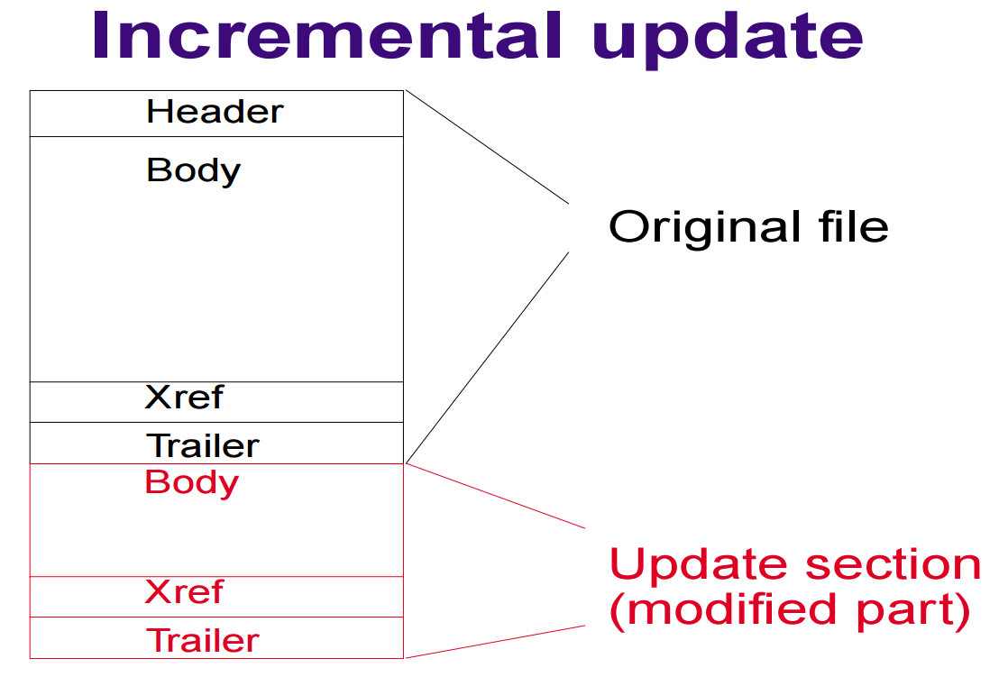

**[Home](https://planepaper.github.io/ko/) >> Incremental Update**

# Incremental Update

파일의 업데이트가 필요한 상황에서, 변경된 사항만이 담긴 패치파일을 다운받아, 로컬에서 직접 패치하는 방법

 

## 개요
2021년, IT 백신회사에서 산업 기능 요원으로서 일하던 당시 `증분 업데이트`라는 프로젝트를 혼자 맡았었다.
 

회사에서는 AWS S3로부터 어떤 1MB 파일을 고객들에게 매번 제공하고 있었는데,

이 파일은 고객들에게 매우 중요한 파일로, 내용이 변경되는 즉시 고객들은 다시 다운 받아야 했다.

- 하루에 7번정도 내용이 빈번히 변경되었지만 변경 내용은 극히 적으면서도 

- `기존 클라이언트는 해당 1mb파일 전체를 전부 다시 받아야 했다.`

- **그 때문에 해당 트래픽으로 드는 비용이 굉장히 비쌌다.**

당시 신입사원으로서 다소 위축되어있던 나에게 엄청난 성장과 자신감을 심어준 프로젝트이기도 하다.
 

## 구현 방식

이 1mb 파일의 내용 변경은 다른 부서에서 이루어졌다.

따라서 기존 일 처리 방식을 최대한 유지하는 방향으로 기능을 검토했다.

1. 다른 부서에서 1mb파일을 변경하고 업로드 시, 자동화 trigger가 작동되어 직전 업로드 파일과 현 파일의 diff로 패치파일을 만들도록 했다.

2. 그리고 이 패치 파일을 서버에 자동으로 배포하고 클라이언트가 업데이트 시 해당 파일을 이용하도록 하였다.

3. 클라이언트에서는 다운받은 해당 패치파일을 현 1mb파일에 적용할 수 있도록 하게 만들었다.
 

## 사용 기술 스택

- c++ 정적라이브러리
    - 백신 프로그램이 c++ 이었기에, 정적라이브러리로 만들어 삽입하였다.
 

- bsdiff 오픈소스 라이브러리
    - c라이브러리이기에 c++에 호출가능하도록 만들었다.
    - 패치파일 생성에는 bsdiff, 패치파일 적용에는 bspatch를 사용하였다.
 

- gtest
    - 정적 라이브러리 test를 위해 사용하였다. ci/cd 자동화 테스트에서도 이용
 

- nginx
    - 테스트 부분의 서버 상황을 구현하기 위해 도입
 

- python
    - ci/cd 스크립트로 aws에 자동 패치파일 생성 및 업로드 기능을 만들었다.
 

## 결과 
결과적으로 기존 트래픽의 총 60%의 비용을 절감할 수 있었다.
 

## 롤백 사고
처음에 완성하고 배포한 결과, 기존 트래픽이 오히려 3배 늘어나 하루만에 급히 롤백됐었다.
 

- 기존 업데이트 로직이 어떤 특수한 상황에서 그 즉시 3번이상 업데이트 시도하던 것이 문제 였다.
    - 그 때문에 제 증분 업데이트 코드가 3번 이상 동작하며 비정상적인 트래픽이 발생했던 것입니다.

- 단기간의 개발이었기 때문에, End-to-end 테스트를 자동화가 아닌 수동으로 하다 놓친 문제였다.
  - 그리고 기존 업데이트 로직을 좀더 꼼꼼히 살피고 end-to-end 테스트를 자동화로 구성했다. 

- 추후, 안정성을 점검 후 다시 배포한 결과, 위와 같이 트래픽을 잘 줄일 수 있었다.

 

## 어려웠던 점

1. 기존의 업데이트 로직에 새롭게 이식하는 것이 굉장히 어려웠다.
 - 담당했던 소프트웨어는 VS2003 환경에 약 20년 정도 된 소프트웨어였고 업데이트 로직 부분이 그간 리팩토링되지 않았다.
 - 따라서 신입사원인 내가 해당 코드들을 전부 분석하고 새로운 기능을 삽입, 그리고 테스트 환경을 구성하는 것이 굉장히 힘들었다.
 <

2. VS2003에 새 기능을 개발하는 것이 어려웠다.
- 굉장히 오래된 ide라 지원하는 기능이 거의 아무것도 없었다.
- 그래서 먼저, 개발하고자 하는 기능만을 VS2019 환경에서 정적라이브러리로 만들었다.
- 테스트와 함께 안정된 기능을 확인한 후에 VS2003상의 포함시키는 식으로 작업을 진행했다.
 

3. 테스트 구현이 힘들었다.
- 역시나 옛날 ide에서 개발된 프로그램이었기에, 테스트 코드 삽입이 힘들었다.
  - 이 또한 역시 VS2019에서 gtest 라이브러리와 nginx로 자동화 테스트를 진행했다.
- 해당 기능은 반드시 서버의 상황과 함께 테스트 되었어야했다.
    - 서버 환경 구현이 힘들었다. 모든 경우에서의 패치파일들을 수동으로 생성하는 것 또한 어려웠다.
    - 자동화 테스트를 위해 기존 ci/cd에 스크립트를 작성해 넣는 것이 어려웠다.
 

## 총평
 - 클린코드가 아니더라도 로직 파악을 좀 더 잘 할 수 있도록 노력해야한다.
 - 좀 더 안정화된 기능을 확인하기 위한 테스트 구현에 힘써야한다.
 - 롤백 사고를 막기 위해 최대한 부지런히 검토해야 한다.