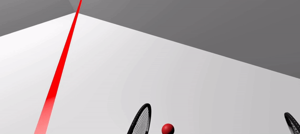
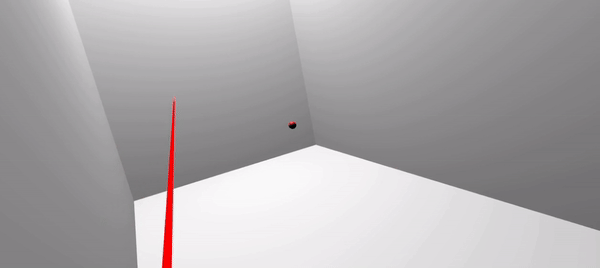

**[Home](https://planepaper.github.io/ko/) >> Racket Smash**

# RacketSmash
유니티 VR 프로젝트

[https://github.com/planepaper/RacketSmash](https://github.com/planepaper/RacketSmash)

- 학교의 VR 프로젝트로 “라켓 스매시”라는 게임 개발

- VR 안에서 공을 라켓으로 맞추는 3D 아케이드 게임
- 모드는 총 4가지를 만들었으며, “두더지 잡기”, “크레이지”, “몬스터 잡기”, 그리고 “벽돌 깨기” 이다.
    - 두더지 잡기 : 정면에서 튀어나오는 두더지를 공으로 맞추는 모드
    - 크레이지 : 여러 곳에서 튀어나오는 공들을 쳐내는 모드
    - 몬스터 잡기 : 위에서 떨어지는 몬스터들을 맞추는 모드
    - 벽돌 깨기 : 정면의 벽돌 조형물을 공으로 맞추는 모드
- 팀 5명이서 unity를 활용해 해당 게임을 개발했다.

### 두더지잡기모드

### 크레이지모드

### 서바이벌모드

### 벽돌깨기모드

## 맡은 역할
전반적인 ‘공 튀기기 기능’과 ‘벽돌 깨기 모드’를 담당했다.

- 공 튀기기 기능은 우선 라켓 오브젝트를 트래커에 MovePosition으로 따라다니도록하여 구현했다. 그리고 공과 라켓을 prefab으로 만들어 다른 모드에서 해당 기능을 동일하게 사용할 수 있도록 하였다.
- 벽돌 깨기 모드는, 공이 방 안을 자유자재로 돌아다닐 수 있도록 공의 material을 무중력 탄성충돌로 만들었다. 그러나 이런 공의 특성상, 유저가 잘 칠 수 있게끔 돌아오지 않는 문제가 발생하였고, 최종적으로는 공이 벽돌에서 돌아올 때, 유저 쪽으로 향해 올 수 있도록 수정해 해결했다.

## 어려웠던 점

### 네트워크 구현

기존의 기획안은 VR을 가진 유저들이 멀티로 스쿼시를 즐기는 것이었다.
하지만 단기간내에 네트워크 부분을 구현하는데 어려움을 겪었다.
Photon Network 라이브러리를 이용해 구현했습니다만, 마스터 클라이언트 이외의 다른 클라이언트에서는 공을 칠 수 없는 문제가 발생했다. 

다른 클라이언트가 보내주는 라켓의 트래킹 정보가 제대로 전달되지 않았기 때문이다. 그래서 마스터 클라이언트 단에서 실제 공의 rigidbody와 라켓의 rigidbody 충돌 계산에 착오가 생겨 정상적인 공 움직임이 이루어지지 않았다. 또한, 라켓과 공의 움직임에도 딜레이가 발생해 네트워크 환경에서도 혼자 공을 주고 받을 수 없었다.

#### 싱크가 맞지 않음

#### 공을 칠 수 없음

#### 딜레이 발생

## 따라서 현 기획으로
이러한 이유들로 주어진 시간에서 멀티 환경을 구성하는 것은 어렵다고 판단했고 기존의 기획  대신 조금 더 가벼운 컨셉의 기획을 새롭게 구상할 필요가 있다고 생각했다. 싱글 아케이드 게임으로 전향하고, 좀 더 스토리라인과 컨셉을 강화시켜 캐주얼한 재미를 살리는 방향을 구상하였다.

## 결과
상기 기능과 모드의 구현을 통해 VR 프로젝트를 성공적으로 완료하였고, 쉬운 게임 방식과 시원한 타격감으로 데모시연회에서 큰 인기를 얻었다. 또한, 교수님께서도 공의 작동방식이 모드마다 다른 것에 대해 다양한 유저경험을 제공하였다고 높이 평가해주셨다.